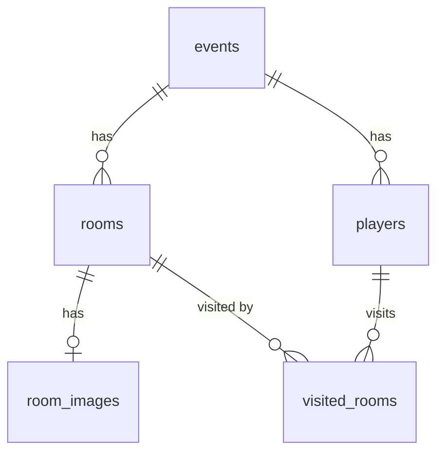

# データベース設計 — StampRallyBot（仮称）

DBアクセス: sqlx（生SQL方式）
DB: MySQL 8.0（ローカル） / TiDB Serverless（本番）

---

## テーブル一覧

| テーブル | 用途 |
|:--|:--|
| `events` | イベント設定（今回は1レコードのみ運用。将来の複数イベント対応の拡張余地として残す） |
| `rooms` | 部屋（チェックポイント）情報 |
| `players` | 参加者（LINEユーザー×イベント） |
| `visited_rooms` | 訪問済み部屋の記録 |
| `room_images` | 部屋の画像バイナリ（UUIDで公開URL生成） |

---

## events（イベント設定）

| カラム | 型 | 説明 |
|:--|:--|:--|
| `id` | INT(PK) | イベントID |
| `event_name` | VARCHAR | イベント名 |
| `admin_pass_hash` | VARCHAR | Argon2ハッシュ化パスワード |
| `is_team_mode` | BOOLEAN | チーム戦フラグ（false = 個人戦） |
| `require_answer_check` | BOOLEAN | 判定モード（true = QR＋正解入力必須、false = QR読み取りのみ） |

---

## rooms（部屋 / チェックポイント）

| カラム | 型 | 説明 |
|:--|:--|:--|
| `id` | INT(PK) | 自動採番 |
| `event_id` | INT(FK) | 所属イベント（`events` 参照、`ON DELETE CASCADE`） |
| `room_name` | VARCHAR(255) | 部屋名 |
| `quest_text` | TEXT | 部屋到着時に提示するクエスト文 |
| `answer` | VARCHAR(255, NULL可) | 正解キーワード（カンマ区切りで複数可）。`require_answer_check = true` のイベントでのみ使用 |
| `hint_msg` | VARCHAR(255, NULL可) | ヒントメッセージ。`require_answer_check = true` のイベントでのみ使用 |
| `image_id` | INT(FK, NULL可) | 画像ID（`room_images` 参照、`ON DELETE SET NULL`） |
| `qr_uuid` | VARCHAR(36) | QRコードに埋め込む一意なUUID |

最大登録数: 15部屋（イベントあたり）

ユニーク制約: `qr_uuid`（`uq_rooms_qr_uuid`）
インデックス: `event_id`（`idx_rooms_event_id`）、`image_id`（`idx_rooms_image_id`）

---

## players（参加者）

| カラム | 型 | 説明 |
|:--|:--|:--|
| `id` | INT(PK) | 自動採番 |
| `line_user_id` | VARCHAR(255) | LINE User ID |
| `event_id` | INT(FK) | 参加イベント（`events` 参照、`ON DELETE CASCADE`） |
| `player_name` | VARCHAR(255) | 個人戦: 個人名 / チーム戦: チーム名 |
| `current_room_id` | INT(FK, NULL可) | 現在案内している部屋（`rooms` 参照、`ON DELETE SET NULL`） |
| `answer_verified` | BOOLEAN | 現在の部屋で正解済みか（`require_answer_check = true` のイベントでのみ使用。部屋が変わるたびに `false` にリセット） |
| `started_at` | DATETIME | 参加登録日時 |
| `finished_at` | DATETIME(NULL可) | 全15部屋クリア日時（未クリアはNULL） |

ユニーク制約: `(line_user_id, event_id)`（`uq_players_line_user_event`）
インデックス: `event_id`（`idx_players_event_id`）、`current_room_id`（`idx_players_current_room_id`）

---

## visited_rooms（訪問済み部屋の記録）

| カラム | 型 | 説明 |
|:--|:--|:--|
| `player_id` | INT(FK) | プレイヤー（`players` 参照、`ON DELETE CASCADE`） |
| `room_id` | INT(FK) | 訪問済みの部屋（`rooms` 参照、`ON DELETE CASCADE`） |
| `visited_at` | DATETIME | チェックイン日時 |

複合主キー: `(player_id, room_id)`
インデックス: `room_id`（`idx_visited_rooms_room_id`）

このテーブルの件数がそのプレイヤーの訪問済み部屋数となり、次の部屋のランダム抽選時は「このテーブルに存在しない `rooms`」から選出する。件数が15に達した時点で `players.finished_at` を記録する。

---

## room_images（画像ストレージ）

| カラム | 型 | 説明 |
|:--|:--|:--|
| `id` | INT(PK) | 内部管理ID |
| `uuid` | VARCHAR(36) | **公開URL用ID**（`/public/image/{uuid}`） |
| `data` | LONGBLOB | 画像バイナリ（リサイズ済み） |
| `mime_type` | VARCHAR(255) | MIMEタイプ（`image/jpeg` 等） |

ユニーク制約: `uuid`（`uq_room_images_uuid`）

---

## ER概要

