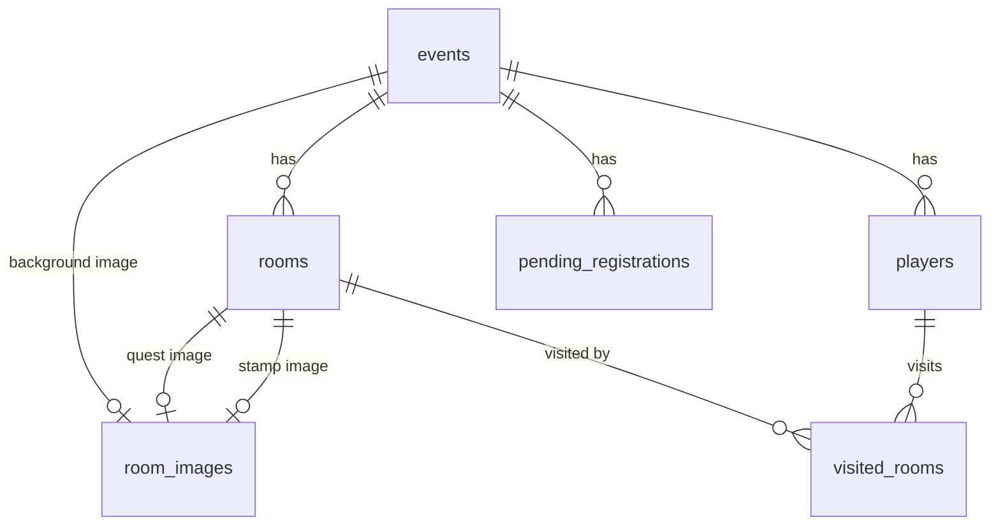

# データベース設計 — StampRallyBot

DBアクセス: sqlx（生SQL方式）
DB: MySQL 8.0（ローカル） / TiDB Serverless（本番）

---

## テーブル一覧

| テーブル | 用途 |
|:--|:--|
| `events` | イベント設定（今回は1レコードのみ運用。将来の複数イベント対応の拡張余地として残す） |
| `rooms` | 部屋（チェックポイント）情報 |
| `players` | 参加者（LINEユーザー×イベント） |
| `visited_rooms` | 訪問済み部屋の記録 |
| `room_images` | 画像バイナリの汎用ストレージ（UUIDで公開URL生成）。部屋のクエスト画像・スタンプ画像・スタンプカード台紙画像で共有 |
| `pending_registrations` | LINE Botの参加登録の一時状態（「開始」〜名前入力までの間）。無料枠ホスティングのスリープ・再起動に耐えるためDB永続化する（[architecture.md 9節](architecture.md#9-会話状態管理参加登録の一時状態)） |

---

## events（イベント設定）

| カラム | 型 | 説明 |
|:--|:--|:--|
| `id` | INT(PK) | イベントID |
| `event_name` | VARCHAR(255) | イベント名 |
| `admin_pass_hash` | VARCHAR(255) | Argon2ハッシュ化パスワード |
| `is_team_mode` | BOOLEAN | チーム戦フラグ（false = 個人戦） |
| `require_answer_check` | BOOLEAN | 判定モード（true = QR＋正解入力必須、false = QR読み取りのみ） |
| `stamp_card_background_image_id` | INT(FK, NULL可) | スタンプカード画像全体の台紙用カスタム画像（`room_images` 参照、`ON DELETE SET NULL`）。未設定時は既定のクリーム色の台紙デザイン（[architecture.md 23節](architecture.md#23-スタンプ状況スタンプカード画像)） |

インデックス: `stamp_card_background_image_id`（`idx_events_stamp_card_background_image_id`）

---

## rooms（部屋 / チェックポイント）

| カラム | 型 | 説明 |
|:--|:--|:--|
| `id` | INT(PK) | 自動採番 |
| `event_id` | INT(FK) | 所属イベント（`events` 参照、`ON DELETE CASCADE`） |
| `room_name` | VARCHAR(255) | 部屋名 |
| `quest_text` | TEXT | 部屋到着時に提示するクエスト文 |
| `answer` | VARCHAR(255, NULL可) | 正解キーワード（カンマ区切りで複数可）。`require_answer_check = true` のイベントでのみ使用 |
| `hint_msg` | VARCHAR(255, NULL可) | ヒントメッセージ。`require_answer_check = true` のイベントでのみ使用 |
| `image_id` | INT(FK, NULL可) | 画像ID（`room_images` 参照、`ON DELETE SET NULL`） |
| `qr_uuid` | VARCHAR(36) | QRコードに埋め込む一意なUUID |
| `stamp_label` | VARCHAR(4, NULL可) | スタンプカード上でその部屋のスタンプに表示する短い文字列。管理画面の部屋登録・編集フォームでは必須項目として入力させるが、カラム自体はNULL許容にする（この機能追加より前に登録された既存の部屋データを壊さないため）。NULLの場合、スタンプ生成時は`room_name`から機械的に切り詰めた文字列にフォールバックする |
| `stamp_image_id` | INT(FK, NULL可) | その部屋専用のスタンプ画像（`room_images` 参照、`ON DELETE SET NULL`）。未設定時は`stamp_label`を使ったはんこ風の自動生成スタンプになる |

最大登録数: 15部屋（イベントあたり）

ユニーク制約: `qr_uuid`（`uq_rooms_qr_uuid`）
インデックス: `event_id`（`idx_rooms_event_id`）、`image_id`（`idx_rooms_image_id`）、`stamp_image_id`（`idx_rooms_stamp_image_id`）

---

## players（参加者）

| カラム | 型 | 説明 |
|:--|:--|:--|
| `id` | INT(PK) | 自動採番 |
| `line_user_id` | VARCHAR(255) | LINE User ID |
| `event_id` | INT(FK) | 参加イベント（`events` 参照、`ON DELETE CASCADE`） |
| `player_name` | VARCHAR(255) | 個人戦: 個人名 / チーム戦: チーム名 |
| `current_room_id` | INT(FK, NULL可) | 現在案内している部屋（`rooms` 参照、`ON DELETE SET NULL`） |
| `answer_verified` | BOOLEAN | 現在の部屋で正解済みか（`require_answer_check = true` のイベントでのみ使用。部屋が変わるたびに `false` にリセット） |
| `started_at` | DATETIME | 参加登録日時 |
| `finished_at` | DATETIME(NULL可) | 全15部屋クリア日時（未クリアはNULL） |
| `stamp_card_token` | VARCHAR(36, NULL可) | スタンプカード画像（`/public/stamp-card/{token}`）公開用の一意なUUID。登録時に発行（[architecture.md 23節](architecture.md#23-スタンプ状況スタンプカード画像)） |

ユニーク制約: `(line_user_id, event_id)`（`uq_players_line_user_event`）、`stamp_card_token`（`uq_players_stamp_card_token`）
インデックス: `event_id`（`idx_players_event_id`）、`current_room_id`（`idx_players_current_room_id`）

---

## visited_rooms（訪問済み部屋の記録）

| カラム | 型 | 説明 |
|:--|:--|:--|
| `player_id` | INT(FK) | プレイヤー（`players` 参照、`ON DELETE CASCADE`） |
| `room_id` | INT(FK) | 訪問済みの部屋（`rooms` 参照、`ON DELETE CASCADE`） |
| `visited_at` | DATETIME | チェックイン日時 |

複合主キー: `(player_id, room_id)`
インデックス: `room_id`（`idx_visited_rooms_room_id`）

このテーブルの件数がそのプレイヤーの訪問済み部屋数となり、次の部屋のランダム抽選時は「このテーブルに存在しない `rooms`」から選出する。件数が15に達した時点で `players.finished_at` を記録する。

---

## room_images（画像ストレージ）

汎用の画像バイナリストレージ。部屋のクエスト画像（`rooms.image_id`）だけでなく、部屋のスタンプ画像（`rooms.stamp_image_id`）・スタンプカード台紙画像（`events.stamp_card_background_image_id`）も同じテーブルを共有する（テーブル名は歴史的経緯で`room_images`のままだが、用途を部屋の画像に限定しない）。

| カラム | 型 | 説明 |
|:--|:--|:--|
| `id` | INT(PK) | 内部管理ID |
| `uuid` | VARCHAR(36) | **公開URL用ID**（`/public/image/{uuid}`） |
| `data` | LONGBLOB | 画像バイナリ（リサイズ済み） |
| `mime_type` | VARCHAR(255) | MIMEタイプ（`image/jpeg` 等） |

ユニーク制約: `uuid`（`uq_room_images_uuid`）

---

## pending_registrations（参加登録の一時状態）

| カラム | 型 | 説明 |
|:--|:--|:--|
| `line_user_id` | VARCHAR(255) | LINE User ID |
| `event_id` | INT(FK) | 対象イベント（`events` 参照、`ON DELETE CASCADE`） |
| `created_at` | DATETIME | 登録待ち状態になった日時 |

複合主キー: `(line_user_id, event_id)`

「開始」コマンド受信時に1行追加し、名前入力で`players`行を作成した後（または「リセット」受信時）に削除する。`players`行と異なりこのテーブルの行は一時的なものであり、名前確定前の状態のみを表す。

---

## ER概要

